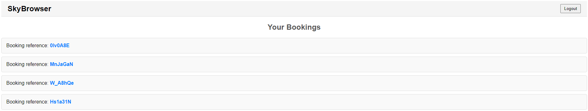
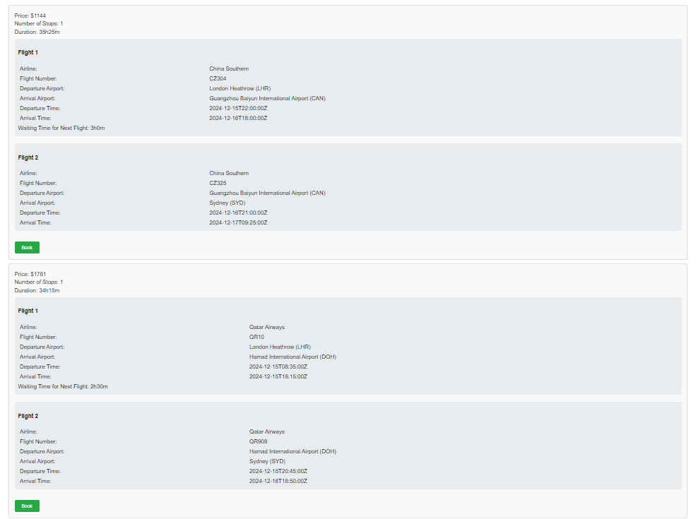
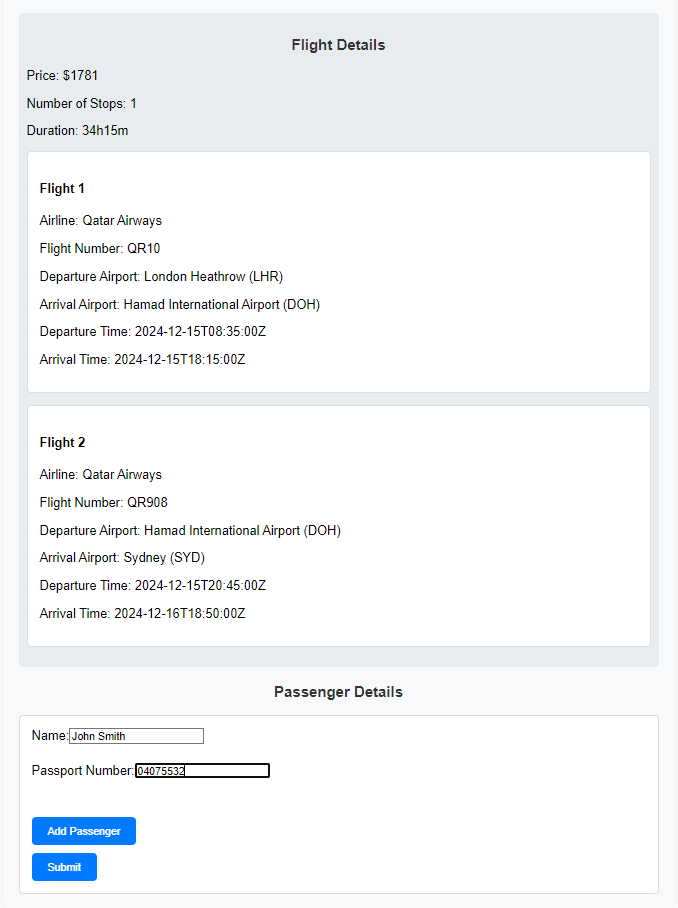
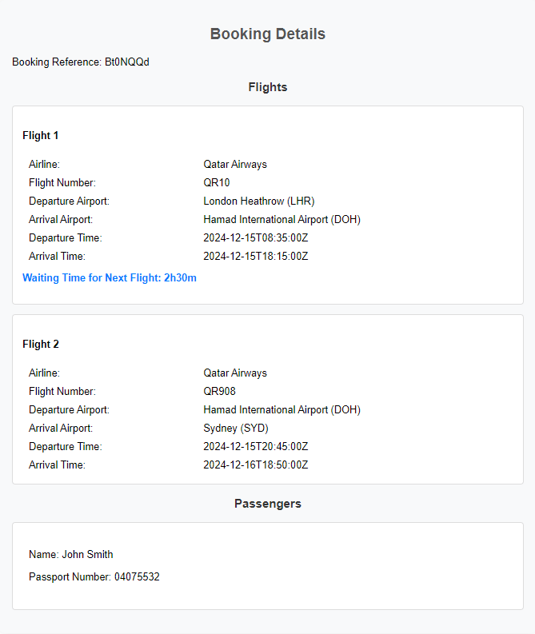

# Sky Browser

## Introduction

Sky Browser is a flight management application built using Java Spring Boot. It allows users to manage their flight reservations, search for flights, and view detailed information about flights and passengers.

## Features

- **User Authentication**: Users can log into their accounts to access personalized features.
- **Manage Reservations**: View and manage existing reservations directly from the homepage.

- **Search Flights**: Search for flights by entering departure and arrival airport codes and the desired date.

- **View and compare results**: A Google Flights API has been integrated in order to generate real results, so the user is able to compare different itineraries and airlines, and select one to make a reservation.

- **Make a reservation**: After selecting an option, the user is directed to a page where all the itinerary details are visible and also, the user would be required to add passenger details. One can add as many passengers as needed by clicking on 'Add passenger'.

- **Reservation code**: When clicking submit, the reservation is generated, and the user will be redirected to a reservation page containing all the details.
- **View Reservation Details**: Access detailed information about each reservation, including flight and passenger details.

